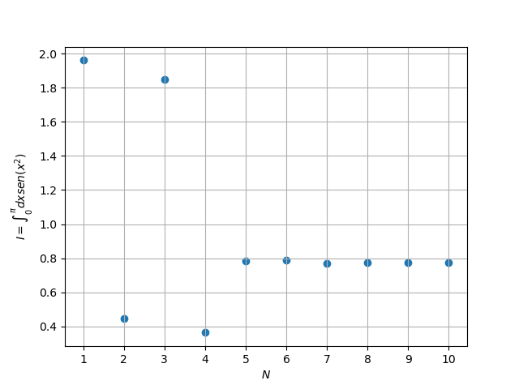

# Ejemplo de uso

## Codigo de ejemplo
```python
    n_max = 11
    n_values = np.arange(1, n_max)
    result_values = np.zeros(n_max-1)

    for N in range(1,n_max):
        xN, wN = gaussxw(N)
        puntoN, pesoN = gaussxwab(0, np.pi, xN, wN)
        result_values[N-1] = np.sum([pesoN * funcInt(puntoN)])
        print(result_values[N-1])

    fig, ax = plt.subplots(dpi=100)

    ax.scatter(n_values, result_values)

    plt.grid()
    plt.ylabel(r'$I= \int^{\pi}_0 dx sen(x^2)$')
    plt.xlabel("$N$")
    plt.xticks(n_values)
    plt.show()    
```
## Imagen obtenida



